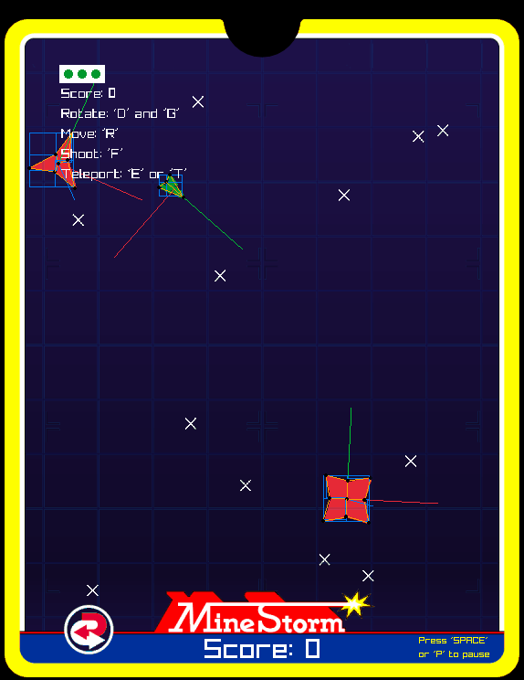
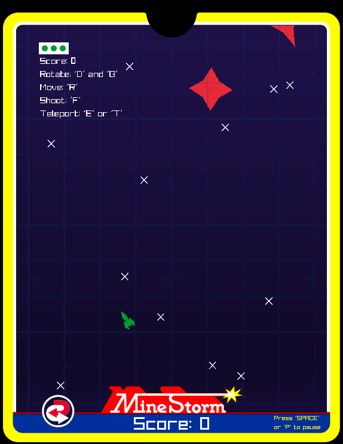
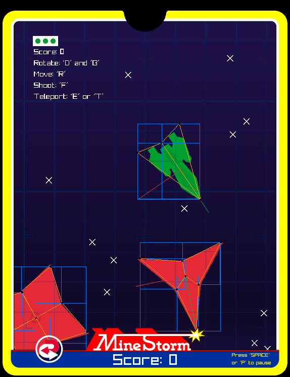
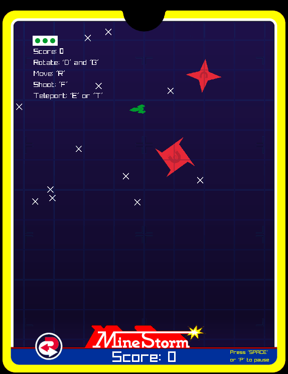

Présentation:
===

&nbsp;&nbsp;&nbsp;&nbsp;&nbsp;&nbsp;Le principe du jeu est de survivre au plus de vagues d’ennemis possibles. Pour cela, les joueurs peuvent déplacer leurs vaisseaux en suivant le modèle de dynamique newtonienne (principe d’inertie, friction...) afin d’esquiver les ennemis. Ils peuvent aussi tirer sur les mines pour les détruire. Chaque type de mine a une particularité qui lui est propre.

&nbsp;&nbsp;&nbsp;&nbsp;&nbsp;&nbsp;Le joueur et les autres entités peuvent traverser les bordures de l’écran pour se rendre à la bordure opposée afin de se déplacer plus vite. Le joueur peut aussi se téléporter pour esquiver les ennemis.

&nbsp;&nbsp;&nbsp;&nbsp;&nbsp;&nbsp;Une fois toutes les mines détruites, une nouvelle vague plus compliquée se lance (plus d’ennemis, ennemis plus rapides, plus gros). À chaque nouvelle manche des points de spawn apparaissent au hasard sur l’écran. Un certain nombre de mines apparaîtront à ces points de spawn en fonction du nombre de manches passées. Une fois une mine détruite, celle-ci en fera apparaître deux autres si sa taille le permet et fera augmenter le score du joueur qui l’a détruite.

&nbsp;&nbsp;&nbsp;&nbsp;&nbsp;&nbsp;Certaines mines, après avoir été détruites, pourront tirer une fireball en direction du joueur le plus proche. Celle-ci peut aussi être détruite pour gagner du score.

&nbsp;&nbsp;&nbsp;&nbsp;&nbsp;&nbsp;Si tous les points de spawns ont été utilisés et qu’il reste des mines à l’écran, le Minelayer apparaîtra et ajoutera de nouveaux points de spawn. Ceux-ci feront apparaître des grosses mines (qui à leur destruction ne créeront pas de nouvelles mines).

&nbsp;&nbsp;&nbsp;&nbsp;&nbsp;&nbsp;Une fois que tous les joueurs ont perdu leurs trois vies, la partie s’arrête. Le score et l’écran de GAME OVER s’affichent.

 

Particularité:
===
&nbsp;&nbsp;&nbsp;&nbsp;&nbsp;&nbsp;Le jeu peut se jouer jusqu’à quatre joueurs. Chaque joueur aura une couleur qui lui
est propre. Ainsi qu’un nombre de vies, un score et une partie du HUD qui lui sont dédiés.

 

Bugs connus:
===
&nbsp;&nbsp;&nbsp;&nbsp;&nbsp;&nbsp;Il arrive quelquefois que des particules réapparaissent pour aucune raison.

 

Contrôles:
===
*Global:*
- Pause -> ‘P’ ou ‘SPACE’
- Debug Mode -> ‘C’

*Joueur 1:*
- Avancer -> ‘R’
- Pivoter -> ‘D’ et ‘G’
- Tirer -> ‘F’
- Se téléporter -> ‘E’ et ‘T’

*Joueur 2:*
- Avancer -> ‘I’
- Pivoter -> ‘J’ et ‘L’
- Tirer -> ‘K’
- Se téléporter -> ‘U’ et ‘O’

*Joueur 3:*
- Avancer -> ‘UP’
- Pivoter -> ‘RIGHT’ et ‘LEFT’
- Tirer -> ‘DOWN’
- Se téléporter -> ‘Ctrl Right’ et ‘KEY_0’

*Joueur 4:*
- Avancer -> ‘KEY_8’
- Pivoter -> ‘KEY_4’ et ‘KEY_6’
- Tirer -> ‘KEY_5’
- Se téléporter -> ‘KEY_7’ et ‘KEY_9’
 
 

<ins>Les ressources visuelles ( .gif ) se trouvent dans le dossier ‘annexes’.</ins>

<ins>L'entièreté des .cpp se trouve dans le dossier ‘src’ et l’entièreté des .h dans le dossier include/.</ins>

<ins>Les fonctions et structs non utilisées sont marquées comme “Not used” dans les .h et/ou dans les .cpp</ins>

 

<ins>*annexe01.gif:*</ins>
- Debug mode (AABBs, vecteurs directeurs et wireframe des polygones)
-> Calcul des AABBs: **ConvexPolygon::getAABB() et ConcavePolygon::getAABB() dans [maths_utils.cpp](./src/maths_utils.cpp) (l.48 et 67)**

- Bordures de l’écran fonctionnelles
-> Déplacement des entités à travers les bordures de l’écran: **Entity::stayInScreen() dans [entity.cpp](./src/entity.cpp) (l.36)**

- Mouvements du joueur, modèle dynamique newtonien
-> Vecteurs vitesse (bleu) et accélération (blanc), friction et drift: **Player::move() dans [player.cpp](./src/player.cpp) (l.151)**

 

<ins>*annexe02.gif:*</ins>
- Système de tir

- Collisions\
&nbsp;&nbsp;&nbsp;&nbsp;&nbsp;&nbsp;-> Intersection Circle/AABB: **intersect() dans [intersection.cpp](./src/intersection.cpp) (l.106)**\
&nbsp;&nbsp;&nbsp;&nbsp;&nbsp;&nbsp;-> Intersection SAT Circle/Convexe Polygon: **intersect() dans [intersection.cpp](./src/intersection.cpp) (l.191)**\
&nbsp;&nbsp;&nbsp;&nbsp;&nbsp;&nbsp;-> Intersection Circle/Concave Polygon: **intersect() dans [intersection.cpp](./src/intersection.cpp) (l.253)**\
&nbsp;&nbsp;&nbsp;&nbsp;&nbsp;&nbsp;-> Intersection Circle/Circle: **intersect() dans [intersection.cpp](./src/intersection.cpp) (l.97)**
- Subdivision des mines

 

<ins>*annexe03.gif (La taille des entités a été agrandie pour voir correctement les collisions):*</ins>
- Collisions\
-> Intersection AABB/AABB: **intersect() dans [intersection.cpp](./src/intersection.cpp) (l.122)**\
-> Intersection SAT Convex Polygon/Convex Polygon: **intersect() dans
[intersection.cpp](./src/intersection.cpp) (l.157)**\
-> Intersection Concave Polygon/Concave Polygon: **intersect() dans
[intersection.cpp](./src/intersection.cpp) (l.228)**

 

<ins>*annexe04.gif:*</ins>
- Bordures de l’écran fonctionnelles\
-> Choix du chemin le plus court: **Entity::getInScreenDirection() dans [entity.cpp](./src/entity.cpp)
(l.24)**

 

<ins>*Autres fonctions et structs non-représentées:*</ins>
- Structs des primitives géométriques (vecteurs, lines, segments...): **[maths_toolbox.h](./include/maths_toolbox.h)**
- Entièreté des fonctions de vecteur (operators, magnitude, distance,
normal, rotate, normalization, dot product): **[vector.cpp](./src/vector.cpp)**

- Struct de range: **[range.h](./include/range.h)**
- Entièreté des fonctions de range (constructeurs, merge et interfere): **[range.cpp](./src/range.cpp)**

- Struct de référentiel: **[referential.h](./include/referential.h)**
- Fonctions de référentiel demandées (Position/Vector Local <-> World): quatre
première fonctions dans **[referential.cpp](./src/referential.cpp)**
- Fonctions de référentiel utilitaires (ex: Rotate referential, Convex/Concave Polygon Local <-> World): autres fonctions dans **[referential.cpp](./src/referential.cpp)**

- Autres fonctions d’intersection non-utilisées (Line/Line, Segment/Circle, etc.):
**[intersection.cpp](./src/intersection.cpp)**

- Autres fonctions utilitaires (min, max, clamp, sign, getAABB, etc.): **[maths_utils.cpp](./src/maths_utils.cpp)**

- Calcul de la vitesse d’une mine et de son score rapporté en fonction de sa taille et de la difficulté: constructeurs des **fireball_mines, floating_mines, magnetic_fireball_mines, magnetic_mines**, exemple dans **[floating_mine.cpp](./src/floating_mine.cpp) (l.42 et 44)**

- Utilisation des fonctions d’intersections:\
-> **Bullet::checkCollisionMinelayer(), Bullet::checkCollisionMine(),
Bullet::checkCollisionFireball() dans [bullet.cpp](./src/bullet.cpp) (l.38, 60 et 88)**\
-> **Fireball::checkCollisionScreenBorder(), Fireball::checkCollisionPlayer()
dans [fireball.cpp](./src/fireball.cpp) (l.48 et 54)**\
-> **Player::checkCollisionMine() dans [player.cpp](./src/fireball.cpp) (l.79)**